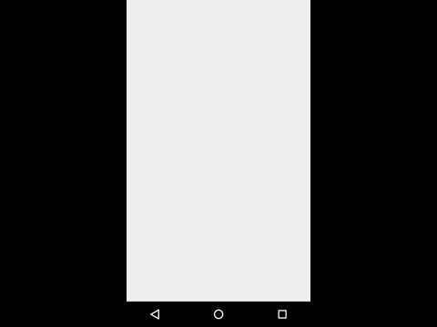

# CardAnimation
>Android Custom Library Animation

CardAnimation is an animation like Tinder, LOVOO.
  - Start Animation
  - Left/Right Animation
  - Cancel Animation
  - Touch Animation

Demo
===================


  
How to use?
===================
1. new CardAnimation(Activity, CardAnimListener, Container)
    ```
    CardAnimation animation = new CardAnimation(MainActivity.this, cardAnimListener, rl_container);
    ```

2. FirstLoading(Cards in Queue )
    ```
    Queue<View> card = new LinkedList<>();
    animation.FirstLoading(card);
    ```

3. And set OnClickListener or OnTouchListener at Card. 

4. Then you can use ```alreadyCard()``` ```clickCard()```  ```cancelCard()```  ```goCard()``` to display Card animation.


# License

    Copyright 2013 KoChunKai

    Licensed under the Apache License, Version 2.0 (the "License");
    you may not use this file except in compliance with the License.
    You may obtain a copy of the License at

       http://www.apache.org/licenses/LICENSE-2.0

    Unless required by applicable law or agreed to in writing, software
    distributed under the License is distributed on an "AS IS" BASIS,
    WITHOUT WARRANTIES OR CONDITIONS OF ANY KIND, either express or implied.
    See the License for the specific language governing permissions and
    limitations under the License.

